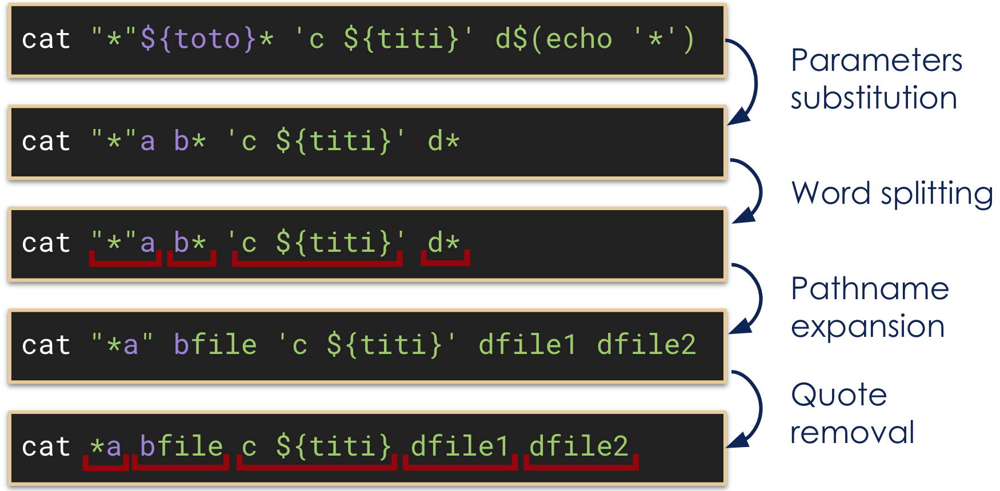

# Command line - shell-scripts - lab

Introduction to bash and tame your Terminal and play with basic shell scripts

## Terror of Terminal (it's ok we're here to help)


## 0 - Start by essential shortcut! 

| Command | Description |
| :---: | --- |
| <kbd>CTRL</kbd>+<kbd>a</kbd> | Go to the beginning of the line |
| <kbd>CTRL</kbd>+<kbd>e</kbd> | Go to the end of the line |
| <kbd>Alt</kbd>+<kbd>b</kbd> / <kbd>Alt</kbd>+<kbd>&larr;</kbd> | Move one word backward |
| <kbd>Alt</kbd>+<kbd>f</kbd> / <kbd>Alt</kbd>+<kbd>&rarr;</kbd> | Move one word forward |
| <kbd>CTRL</kbd>+<kbd>w</kbd> / <kbd>&#8984;</kbd>+<kbd>Delete</kbd> | Delete one word backward |
| <kbd>CTRL</kbd>+<kbd>k</kbd> | Delete until end of the line |
| <kbd>CTRL</kbd>+<kbd>u</kbd> | Delete until beginning of the line |

Disclaimer: some of commands can be different depend on the OS or Bash

### Configure your Terminal 

- Switch to infinite history! 

```bash
# In your bashrc
# Enable infinite history
export HISTSIZE=
export HISTFILESIZE=
```

- Recall your commands!

| Command | Description |
| :---: | --- |
| <kbd>CTRL</kbd>+<kbd>p</kbd> | Recall the previous command in the history |
| <kbd>CTRL</kbd>+<kbd>n</kbd> | Recall the next command in the history |
| <kbd>CTRL</kbd>+<kbd>r</kbd> | Do a search in your history |

- Enable advanced completion

```bash
# On Mac OS X
brew install bash-completion

# On Linux (Debian/Ubuntu) 
apt-get install bash-completion`
```

## 1 - Globbing

This wildcard symbol `*` will be replaced by all matching elements

```bash
# List all png files:
ls *.png

# List all files that contains report
ls *report*

# List both png and gif files
ls *.{png,gif}

# List all zip part files
ls archive-part[a-z].zip
```

## 2 - Pipes

Pipes let you use the output of a command as the input of another one.
- You can pipe as many command as you want

```bash
# count number files/folders
ls -1 | wc -l     

# list only 'static' files/folders
ls -l | grep 'static'
```

*Exercice: Count how many pdf file and put it into a file*  

## 3 - Command exit code/status

This value is referred to as an exit code or exit status. On POSIX systems the standard convention is for the program to pass 0 for successful executions and 1 or higher for failed executions

```bash
# Print success exit code 0.
ls
README.md static
echo $?
0

# Print failed exit code 127
command-not-found
command not found: command-not-found
echo $?
127
```

## 4 - Chaining operators

You can chain command one after the other here's different type of operators

- `;` Execute command sequentially
```bash  
# list current file and then read space disk
ls -l ; df -h
```
- `&&` Execute command sequentially if the previous one is a success
```bash
# For ubuntu update packages and if the first command succeed then upgrade packages
apt-get update && apt-get upgrade
```
- `||` Execute next command if the previous one is a failure
```bash
# Ping octo website and if not succeed create test folder
ping octo.com || mkdir test
```
- `!` Execute all except the condition provided
```bash
# Delete all files in current directory expect html files
rm -r !(*.html)
```

## 5 - Process Management
 
- Classic
```bash
# Launch a command in the background
command &

# Put foreground the last command in background
fg

# Put in the background the currently paused process
bg
```

- Alternative
```bash
# use "screen"
screen
my-long-command
```
Press <kbd>CTRL</kbd>+<kbd>a</kbd>+<kbd>d</kbd> to put in background
```bash
# Create as many screen as you want and list them
screen -ls

# Reattach to a screen
screen -r PID
```

- useful command

| Command | Description |
| :---: | --- |
| <kbd>CTRL</kbd>+<kbd>c</kbd> | Try to stop the current process |
| <kbd>CTRL</kbd>+<kbd>z</kbd> | Pause the current process | 

## 6 - Quoting

- Double quotes protect from word splitting and pathname expansions

```bash
# Display the content of a file named "a b*"
cat "a b*"
```


- Single quotes protect from everything

```bash
# Display the content of a file named "${toto}" (no variable substitution)
cat '${toto}'
```

## 7 - Redirections

There are 3 descriptors, stdin for input, stdout for output and stderr error output (std=standard).

Basically you can:

- redirect stdout to a file
- redirect stderr to a file
- redirect stdout to a stderr
- redirect stderr to a stdout
- redirect stderr and stdout to a file
- redirect stderr and stdout to stdout
- redirect stderr and stdout to stderr

For command line `1` represents stdout and `2` stderr.

```bash
# list current files and put it into a file
ls -l > ls-l.txt

# redirect stderr in errors.log
my-command 2> errors.log

# look for all content with 'da' and redirect the result to stderr 
grep da * 1>&2

# delete files finishing by core and redirect all output to nowhere, means wipe the output
rm -f *core &> /dev/null
```

## Some useful command

- `find`: recursively search for files
- `grep`: search for text in standard input or files
- `awk/sed/tr`: text/lines/character manipulation
- `xargs`: use output as arguments of another command
- `sort`: sort lines numerically or alphabetically on the given field
- `uniq`: exclude contiguous duplicate lines
- `wc`: count words, lines, bytes…
- `head/tail`: display beginning/end of files or standard input
- `date`: display the current or given date with the given format

# Bash scripts

Build your script to help you automate 


## Basic syntax rules

```bash
# Variable assignement
toto="tutu"

# Variable reference
echo "${toto}"

# Or boolean logic
command1 || command2

# And boolean logic
command1 && command2

# command1 then command2
command1; command2

# Capture command output
titi=$(command1)
```

## Basic control structures
- `if else` statement
```bash
if command; then
    do_this
elif other_command; then
    do_that
else
    do_something_else
fi    
```
- switch `case`
```bash
case ${option} in 
 -h) display_help;;
 -*) error "bad_option";;
 *) error "unknown argument";;
esac
```
- loop using `for`
```bash
for var in 1 2 3 4 5; do
    echo ${var}
done
```
- loop using `while`
```bash
while command; do 
    do_it || break
done
```

## Essential built-in commands

```bash
# Display string
echo "Hello World"

# Make variable TOTO available to sub-processes
export TOTO=titi
echo $TOTO
# display titi

# Execute shell instruction in file toto.sh
source toto.sh

# Interpret the given arguments as new shell command to execute
eval $TOTO=\$TITI

# Read standard input next line and put it in variable TOTO
read -r TOTO

# Test VAR1 is defined and greater than 13
[ -n "$VAR1" ] && [ "$VAR1" -gt 13 ]
```

## Special variables

- `$1`, `$2`, `$3` ...: arguments passed to function or scripts
- `$#`: number of arguments passed to function or scripts
- `$@`: all arguments
- `$$`: current PID (process id) of the running shell
- `$?`: exit code of the last command
- `$!`: PID of last background process
- `$RANDOM`: random number between 0 and 32767

## Shell traps

- The lost variable
```bash
# Always print SUM=0
SUM=0
cat file | while read -r SUM; do
    SUM=$((SUM + 1))
done
echo -- "SUM=${SUM}"
```
- The input vaccum cleaner
```bash
# Stop after first hostname!
while read HOSTNAME; do
  ssh "${HOSTNAME}" "command"
done < list_of_hosts.txt
```
- The dangerous replace
```bash
# Doesn’t work if VAR
# contains slashes  
sed -e "s/VAR/${VAR}/g” \ file
```
- Argument with space inside
```bash
# Doesn’t work if arg has space
for arg in $@; do
  cat "${arg}"
done
```

## How the shell process your lines

- Initial state
```
Variables:    toto="a b"     titi="file"
Local files:  filea, bfile, cfile, dfile1, dfile2
```
- What happens when we execute this line?
```bash
cat "*"${toto}* 'c ${titi}' d$(echo '*')
```



## Learn useful tools

- Use **tldr** to quickly grasp how to use them
```bash
brew install tldr
tldr sed
```
- Use **man** to understand them in depth
```bash
man sed
``` 

# Challenges 

Let's start some hands-on

## 1. Bash - Find the biggies!

Create a shell one-liner that lists the top 10 of the files bigger than 1G under the /usr folder with at least the full path name and the file size.

*Bonus: if file size is displayed in human readable format (2.4G, 54k, 12M...)*

*Helps*:
- use `find` and look for options 
- use `-exec` `find` option to display details
- for mac user use `gsort` instead of `sort` 
    - install command: `brew install coreutils`

## 2. Bash - Make some room

Create a shell one-liner that display files older than 1 month in the current folder and compresses them silently with tar.

*Bonus: if compression is done in parallel and if bigger files are compressed first.*

*Helps*: 
- use `-mtime` option
- use `xargs` to get the output

## 3. Script - Find a movie to watch with your partner
Write a shell script that display the list of comedy movies that were released between 4 and 3 months ago and that have more than 8 of average score.

*Info:* 
- Documentation URL: `https://www.themoviedb.org/documentation/api/discover`
- API Key: `eecc946ec5ea05d0f35c9f842e8142a2`
- Example API Call: `https://api.themoviedb.org/3/discover/movie?primary_release_date.gte=2014-09-15&primary_release_date.lte=2014-10-22&api_key=eecc946ec5ea05d0f35c9f842e8142a2`

# Special thanks to Yann Rouillard
For inspiration for this tutorial (Ok it's more than inspiration...)
