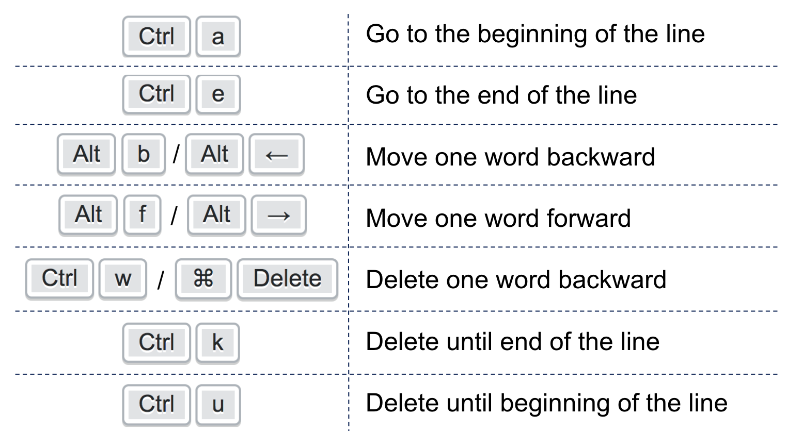

# Command line - shell-scripts - lab

Introduction to bash and tame your Terminal and play with basic shell scripts

## Terror of Terminal (it's ok we're here to help)


## Start by essential shortcut! 



Disclaimer: some of commands can be different depend on the OS or Bash

### Configure your Terminal 

- Switch to infinite history! 

```
# In your bashrc
# Enable infinite history
export HISTSIZE=
export HISTFILESIZE=
```

- Recall your commands!

|-----------------------------|---------------------------------------------|
|<kbd>CTRL</kbd>+<kbd>p</kbd> | Recall the previous command in the history  |
|-----------------------------|---------------------------------------------|
|<kbd>CTRL</kbd>+<kbd>n</kbd> | Recall the next command in the history      |
|-----------------------------|---------------------------------------------|
|<kbd>CTRL</kbd>+<kbd>r</kbd> | Do a search in your history                 |
|-----------------------------|---------------------------------------------|

############## todo

basically can use the content of this prez, please be free to take screenshots, and add exercices in each steps
please thanks YRO somewhere too :) 
https://docs.google.com/presentation/d/1OoUyUwSyq88FlMfaWxY2eY84ItxmvH26ZtAh2kELMoQ/edit#slide=id.g343db3d721_3_1000

good luck mate :)

##### use the command line

#### globing

ls *.png      * will be replaced by all matching files from the current dir finishing by .png


#### pipes


ls -1 | wc -l     
you can chain command,   output of the first one will be the input of the next one
ls -1      list files of current dire
wc -l     count number of lines

you can pipe as many cammand as you want


##### return value

echo command has a return value: 0 means ok
not 0 means error
can see the last returned code with $?

ls
echo $?     => 0

zdzdazdadazdd
echo $?     => 127

#### chaining command

using the return code you can do

ls && ls && ls && ls     execute command one after the other if status code is 0
works also with 'or'
ls || ls || ls || ls

if you dont care about status code, use ;
ls ; ls ; ls


#### some usefull command

find: recursively search for files
grep: search for text in standard input or files
awk/sed/tr: text/lines/character manipulation
xargs: use output as arguments of another command
sort: sort lines numerically or alphabetically on the given field
uniq: exclude contiguous duplicate lines
wc: count words, lines, bytes…
head/tail: display beginning/end of files or standard input
date: display the current or given date with the given format


#### work in background


if the command takes a long time to finish you can run in in background
mycommand &         single & at the end means in background
ps aux | grep mycommand       to see if the process is running
fg     Put foreground the last command in background


alternativement you can use "screen"
$ screen
$ mylongcommand
Controle-A    D      to put in back ground

you can create as many screen as you want 
to list them
$ screen -ls

to reattach to a screen
$ screen -r PID

##### basic scripts

Create a variable
MYVAR="toto"

Use a variable
echo "This is the content of $MYVAR"

special variables
$1 $2 $3    arguments passed to function or scripts
$#: number of arguments passed to function or scripts
$@: all arguments
$?: exit code of the last command


Conditionals

if command; then
    do_this
elif other_ommand; then
    do_that
else
    do_something_else
fi


Loops

while command; do
    do_it || break
done


for var in 1 2 3 4 5; do
    echo ${var}
done


#### quoting

Double quotes protect from word splitting and pathname expansions

Display the content of a file named "a b*"
cat "a b*"

Single quotes protect from everything
Display the content of a file named "${toto}" (no variable substitution)
cat '${toto}'

##### stdout stderror

redirect stdout in toto.log
$ command > toto.log
 
redirect stderr in toto.errors.log
command 2>toto.errors.log

